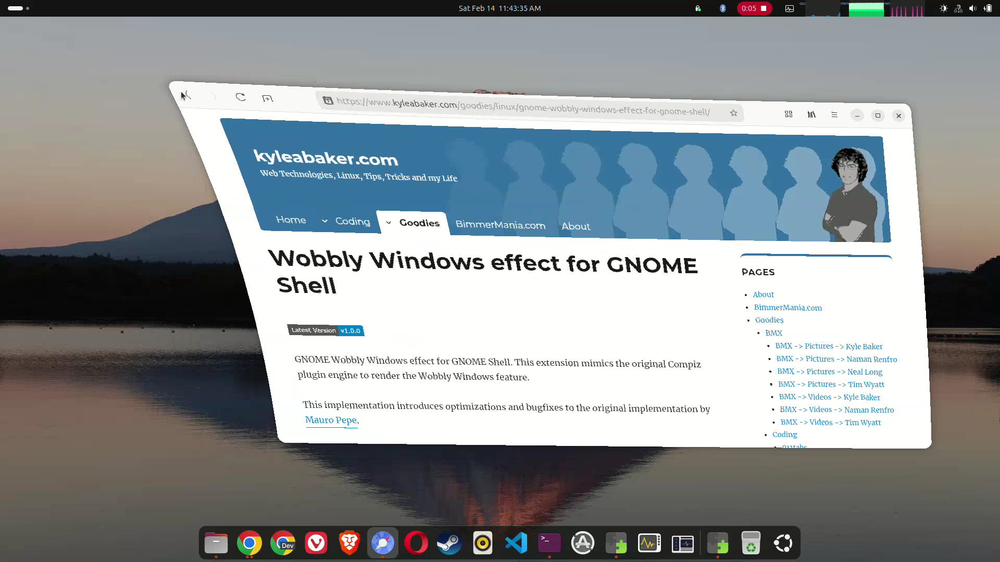

# Wobbly windows effect for GNOME Shell

Wobbly windows effect for GNOME Shell. Mimics the Compiz plugin engine to render the Wobby Windows feature.

## Prerequisite

Does NOT requires any external library.

## Installation

You can install this extension by visiting [the GNOME Shell Extensions page](https://extensions.gnome.org/extension/3210/gnome-wobbly-windows) for this extension.

## Video

You can see extension in action in this [video](https://youtu.be/G8bAVIB9A7A) //TODO
